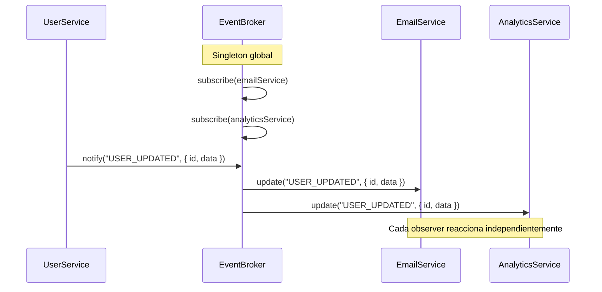

# Observer Pattern — Event Broker en TypeScript

Este proyecto implementa el patrón de diseño **Observer** (también conocido como Publish-Subscribe) usando un **Event Broker** centralizado como intermediario entre productores y consumidores de eventos.

---

## ¿Qué es el patrón Observer?

El Observer es un patrón de diseño de tipo **comportamiento** que establece una relación de uno a muchos entre objetos: cuando un objeto (el **Subject**) cambia de estado, notifica automáticamente a todos sus observadores registrados (**Observers**).

En este proyecto, el Subject se materializa como un **Event Broker** centralizado, lo que permite desacoplar completamente al emisor de los receptores de eventos.

---

## Estructura del proyecto

```
src/
├── core/
│   ├── interfaces/
│   │   ├── observer.interface.ts   ← Contrato que cumplen todos los observadores
│   │   └── subject.interface.ts    ← Contrato que cumple el subject (broker)
│   └── event-broker.ts             ← Broker central (Singleton que implementa Subject)
└── services/
    ├── email.service.ts            ← Observador: envía notificaciones por email
    ├── analytics.service.ts        ← Observador: registra métricas
    └── user.service.ts             ← Emisor: dispara eventos de cambio de usuario
```

---

## Componentes clave

### 1. Interfaces

**`Observer<T>`** — define el contrato de todo observador:

```ts
interface Observer<T> {
  update(event: string, data: T): void;
}
```

**`Subject<T>`** — define el contrato del sujeto que notifica:

```ts
interface Subject<T> {
  subscribe(observer: Observer<T>): void;
  unsubscribe(observer: Observer<T>): void;
  notify(event: string, data: T): void;
}
```

### 2. EventBroker (Subject + Singleton)

El `EventBroker` es el corazón del patrón. Implementa `Subject<T>` y utiliza el patrón **Singleton** para garantizar una única instancia global.

- **`subscribe(observer)`** — registra un observador en un `Set`.
- **`unsubscribe(observer)`** — elimina un observador del `Set`.
- **`notify(event, data)`** — itera sobre todos los observadores registrados y llama a `update(event, data)` en cada uno.

### 3. Observadores concretos

| Servicio | Rol | Comportamiento |
|---|---|---|
| `EmailService` | Observador | Recibe eventos y simula el envío de un email de notificación |
| `AnalyticsService` | Observador | Recibe eventos y simula el registro de métricas |

Ambos implementan la interfaz `Observer<T>` y responden al método `update()`.

### 4. Emisor de eventos (UserService)

`UserService` **no es un observer**, sino el componente que **dispara** eventos. Internamente obtiene la instancia del `EventBroker` y llama a `notify()` cuando ocurre una acción relevante (en este caso, actualizar un usuario).

---

## Flujo de ejecución



**Paso a paso:**

1. Se obtiene la instancia singleton del `EventBroker`.
2. Se suscriben `EmailService` y `AnalyticsService` al broker.
3. Se crea un `UserService`.
4. Al llamar a `userService.update(1, { ... })`, el servicio:
   - Guarda los datos en la "base de datos" (simulado).
   - Llama a `broker.notify("USER_UPDATED", { id, data })`.
5. El broker itera sobre todos los observers y ejecuta `update()` en cada uno.
6. Cada observer reacciona de forma independiente (envía email, registra métricas, etc.).

---

## ¿Por qué usar un Event Broker en lugar de suscribirse directamente al emisor?

| Con Observer directo | Con Event Broker (este proyecto) |
|---|---|
| El Subject conoce a sus Observers | El Subject y los Observers **no se conocen** entre sí |
| Acoplamiento fuerte | **Acoplamiento total** (solo dependen del broker) |
| Difícil agregar nuevos observers sin modificar el subject | **Agregar observers es trivial** — solo `subscribe()` |
| Un subject, muchos observers | **Muchos subjects, muchos observers** — el broker centraliza todo |

---

## Ejecución

```bash
bun install
bun run index.ts
```

Salida esperada:

```
[UserService] Actualizando datos en DB para el usuario 1...
[EmailService] Evento recibido:  USER_UPDATED { id: 1, data: { email: 'jhon@example.com', name: 'John Doe' } }
[Analytics] Procesando métricas para: USER_UPDATED { id: 1, data: { email: 'jhon@example.com', name: 'John Doe' } }
```

---

## Conceptos demostrados

- **Observer Pattern** — desacoplamiento entre emisor y receptores de eventos.
- **Singleton** — una única instancia del `EventBroker` en toda la aplicación.
- **Genéricos TypeScript** — `Observer<T>` y `Subject<T>` son genéricos para soportar cualquier tipo de payload.
- **Programación orientada a interfaces** — los servicios implementan contratos (`Observer<T>`) en vez de depender de clases concretas.